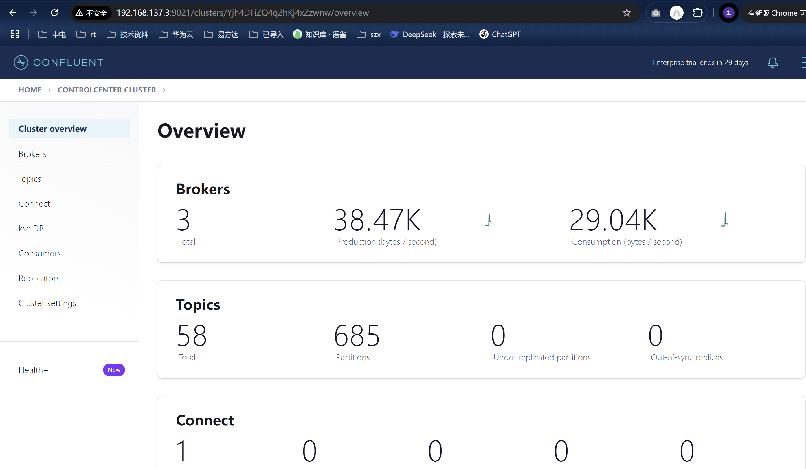

cfk 测试部署：zookeeper 模式

参考：https://docs.confluent.io/operator/current/co-quickstart.html

存储使用 openebs

并把 openebs：openebs-hostpath 作为默认的动态 StorageClass
kubectl patch storageclass <your-class-name> -p '{"metadata": {"annotations":{"storageclass.kubernetes.io/is-default-class":"true"}}}'

[root@kubesphere ~]# kubectl get sc
NAME PROVISIONER RECLAIMPOLICY VOLUMEBINDINGMODE ALLOWVOLUMEEXPANSION AGE
openebs-device openebs.io/local Delete WaitForFirstConsumer false 207d
openebs-hostpath (default) openebs.io/local Delete WaitForFirstConsumer false 207d

